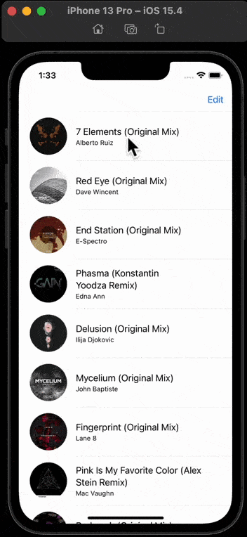
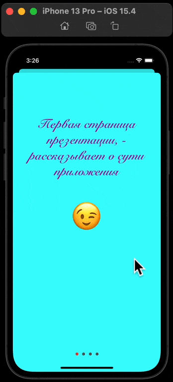

Это примеры маленьких приложений, с целью знакомства и изучения различной функциональности. В каждом из приложений есть готовые шаблоны/примеры использования. Ниже описание:

### [WeeklyFinderArt](https://github.com/artemiosdev/Small-projects/tree/main/WeeklyFinderArt/WeeklyFinderArt)

работа с [Calendar()](https://developer.apple.com/documentation/foundation/calendar) day, month, year, [DateComponents()](https://developer.apple.com/documentation/foundation/datecomponents), [DateFormatter()](https://developer.apple.com/documentation/foundation/dateformatter), вывод даты [dateFormat](https://developer.apple.com/documentation/foundation/dateformatter/1413514-dateformat), взаимодействие с клавиатурой [touchesBegan()](https://developer.apple.com/documentation/uikit/uiresponder/1621142-touchesbegan/) - сообщает этому объекту, что в представлении или окне произошло одно или несколько новых касаний.

---

### [TemperatureConverter](https://github.com/artemiosdev/Small-projects/tree/main/TemperatureConverter/TemperatureConverter/TemperatureConverter)

используется [UISlider](https://developer.apple.com/documentation/uikit/uislider), округление [round()](https://www.advancedswift.com/rounding-floats-and-doubles-in-swift/) 

---

### [PassDataProjectArt](https://github.com/artemiosdev/Small-projects/tree/main/PassDataProjectArt/PassDataProjectArt)

UITextField c login и password, выбор segue  учитывая идентификатор [performSegue(withIdentifier:, sender:)](https://developer.apple.com/documentation/uikit/uiviewcontroller/1621413-performsegue), возврат segue на другой экран с помощью  unwind Segue реализуется как к элементом, так и с View (предпочтительнее). Взаимодействие с [UIStoryboardSegue](https://developer.apple.com/documentation/uikit/uistoryboardsegue/) (destination, source, identifier). Передача данных с одного View на другой, [prepare(for segue: UIStoryboardSegue, sender: )](https://developer.apple.com/documentation/uikit/uiviewcontroller/1621490-prepare) этот метод уведомляет view controller о том, что переход вот-вот будет выполнен. . Взаимодействие с клавиатурой [touchesBegan()](https://developer.apple.com/documentation/uikit/uiresponder/1621142-touchesbegan/) - сообщает этому объекту, что в представлении или окне произошло одно или несколько новых касаний.

---

### [UILabelAndUIButton](https://github.com/artemiosdev/Small-projects/tree/main/UILabel/UILabel)

пример использования [UIButton](https://developer.apple.com/documentation/uikit/uibutton) и [UILabel](https://developer.apple.com/documentation/uikit/uilabel), свойства элементов, верстка кодом `(isHidden, font, text, setTitle, titleLabel?.text, textColor, setTitleColor, backgroundColor)`

---

### [UISegmentedControl, UISlider, UITextField, UIScrollView, UIDatePicker, UISwitch, UIPickerView](https://github.com/artemiosdev/Small-projects/tree/main/UISegmentedControl/UISegmentedControl)

- [UISegmentedControl](https://developer.apple.com/documentation/uikit/uisegmentedcontrol), добавить кодом segment [segmentedContol.insertSegment](https://developer.apple.com/documentation/uikit/uisegmentedcontrol/1618588-insertsegment).

- [UISlider](https://developer.apple.com/documentation/uikit/uislider) (`.value,.minimumValue, .maximumValue, .maximumTrackTintColor, .minimumTrackTintColor,  .thumbTintColor`). 

- [UITextField ]( https://developer.apple.com/documentation/uikit/uitextfield) 
Есть делегат  [UITextFieldDelegate](https://developer.apple.com/documentation/uikit/uitextfielddelegate) с помощью которого можно отслеживать взаимодействия пользователя с текстовым полем. 

- [UIAlertController](https://developer.apple.com/documentation/uikit/uialertcontroller/) an object that displays an alert message.

- [UIAlertAction](https://developer.apple.com/documentation/uikit/uialertaction )
action that can be taken when the user taps a button in an alert.
Создаем кнопку с предупреждением.

- Метод [present()](https://developer.apple.com/documentation/uikit/uiviewcontroller/1621380-present) вызывает на экран наше предупреждение.

- [UIScrollView](https://developer.apple.com/documentation/uikit/uiscrollview)
View, которое позволяет прокручивать и масштабировать содержащиеся в нем view. 

- [UIDatePicker](https://developer.apple.com/documentation/uikit/uidatepicker)
барабан выбора, даты, времени. [DateFormatter()](https://developer.apple.com/documentation/foundation/dateformatter/) - форматирование даты для вывода. 

- [UISwitch](https://developer.apple.com/documentation/uikit/uiswitch)
использования switch для скрытия/отображения элементов на экране, (`.isOn, .onTintColor, .thumbTintColor`) 

- [UIPickerView](https://developer.apple.com/documentation/uikit/uipickerview)
вращающийся барабан с возможностью выбора среди элементов. [UIPickerViewDelegate](https://developer.apple.com/documentation/uikit/uipickerviewdelegate), и [UIPickerViewDataSource](https://developer.apple.com/documentation/uikit/uipickerviewdatasource). Отдельная кнопка в PickerView [UIToolbar](https://developer.apple.com/documentation/uikit/uitoolbar) и [UIBarButtonItem](https://developer.apple.com/documentation/uikit/uibarbuttonitem). При выборе textField за место клавиатуры по умолчанию, вызывается PickerView.

---

### [UITextView, UIStepper, UIActivityIndicatorView, UIProgressView](https://github.com/artemiosdev/Small-projects/tree/main/UITextView/UITextView)

- [UITextView ](https://developer.apple.com/documentation/uikit/uitextview)

- [UITextViewDelegate](https://developer.apple.com/documentation/uikit/uitextviewdelegate) - протокол включающий в себя методы отслеживания тапов, и не только. 

- [UIStepper ](https://developer.apple.com/documentation/uikit/uistepper) - элемент управления, для увеличения или уменьшения значения.

- [UIActivityIndicatorView](https://developer.apple.com/documentation/uikit/uiactivityindicatorview) - анимация прогресса загрузки данных.

- [UIProgressView](https://developer.apple.com/documentation/uikit/uiprogressview) - индикатор прогресса загрузки.

---

### [ArtCover](https://github.com/artemiosdev/Small-projects/tree/main/ArtCover/ArtCover)

- [Struct](https://docs.swift.org/swift-book/LanguageGuide/ClassesAndStructures.html)
- [Navigation Controller Scene](https://developer.apple.com/documentation/uikit/uinavigationcontroller)
- [UINavigationItem](https://developer.apple.com/documentation/uikit/uinavigationitem)
- [UITableViewController](https://developer.apple.com/documentation/uikit/uitableviewcontroller)
- [UIListContentConfiguration](https://developer.apple.com/documentation/uikit/uilistcontentconfiguration) - конфигурация содержимого для представления содержимого на основе списка
- [prepare(for:sender:)](https://developer.apple.com/documentation/uikit/uiviewcontroller/1621490-prepare) - уведомляет контроллер представления о том, что переход вот-вот будет выполнен.
- [tableView(_:numberOfRowsInSection:)](https://developer.apple.com/documentation/uikit/uitableviewdatasource/1614931-tableview) - указывает источнику данных возвращать количество строк в заданном разделе табличного представления.
- [tableView(_:cellForRowAt:)](https://developer.apple.com/documentation/uikit/uitableviewdatasource/1614861-tableview) - запрашивает у источника данных ячейку для вставки в определенном месте табличного представления

---

### [ArtCoverCollectionView](https://github.com/artemiosdev/Small-projects/tree/main/ArtCoverCollectionView/ArtCoverCollectionView)

- [Struct](https://docs.swift.org/swift-book/LanguageGuide/ClassesAndStructures.html)
- [Navigation Controller Scene](https://developer.apple.com/documentation/uikit/uinavigationcontroller)
- [UINavigationItem](https://developer.apple.com/documentation/uikit/uinavigationitem)
- [UICollectionViewController](https://developer.apple.com/documentation/uikit/uicollectionviewcontroller) - контроллер представления, который специализируется на управлении представлением коллекции.
- [UICollectionViewCell](https://developer.apple.com/documentation/uikit/uicollectionviewcell)
- [UICollectionViewFlowLayout](https://developer.apple.com/documentation/uikit/uicollectionviewflowlayout) - верстка элемента кодом
- [prepare(for:sender:)](https://developer.apple.com/documentation/uikit/uiviewcontroller/1621490-prepare) - уведомляет контроллер представления о том, что переход вот-вот будет выполнен.
- [collectionView(_:numberOfItemsInSection:)](https://developer.apple.com/documentation/uikit/uicollectionviewdatasource/1618058-collectionview) - запрашивает у вашего объекта источника данных количество элементов в указанном разделе.
- [collectionView(_:cellForItemAt:)](https://developer.apple.com/documentation/uikit/uicollectionviewdatasource/1618029-collectionview) - запрашивает у вашего объекта источника данных ячейку, соответствующую указанному элементу в представлении коллекции. 

---

### [UIStackView](https://github.com/artemiosdev/Small-projects/tree/main/UIStackView/UIStackView)

[StackView](https://developer.apple.com/documentation/uikit/uistackview) - streamlined interface for laying out a collection of views in either a column or a row.

---

### [UITabBar](https://github.com/artemiosdev/Small-projects/tree/main/UITabBar/UITabBar) 

[TabBar](https://developer.apple.com/documentation/uikit/uitabbar) - a control that displays one or more buttons in a tab bar for selecting between different subtasks, views, or modes in an app.

---
### [AwesomeBrowser](https://github.com/artemiosdev/Small-projects/tree/main/AwesomeBrowser/AwesomeBrowser)

- [WebKit](https://developer.apple.com/documentation/webkit) - integrate web content seamlessly into your app, and customize content interactions to meet your app’s needs.
- [WKWebView](https://developer.apple.com/documentation/webkit/wkwebview)  - an object that displays interactive web content, such as for an in-app browser.
- [WKNavigationDelegate](https://developer.apple.com/documentation/webkit/wknavigationdelegate) - methods for accepting or rejecting navigation changes, and for tracking the progress of navigation requests.
- [UITextFieldDelegate](https://developer.apple.com/documentation/uikit/uitextfielddelegate) - a set of optional methods to manage the editing and validation of text in a text field object.
- [URL](https://developer.apple.com/documentation/foundation/url)
- [URLRequest](https://developer.apple.com/documentation/foundation/urlrequest)
- [load(_:)](https://developer.apple.com/documentation/webkit/wkwebview/1414954-load) - loads the web content that the specified URL request object references and navigates to that content.
- [webView.allowsBackForwardNavigationGestures](https://developer.apple.com/documentation/webkit/wkwebview/1414995-allowsbackforwardnavigationgestu) - Boolean value that indicates whether horizontal swipe gestures trigger backward and forward page navigation. Добавим свайпы вперед и назад

Свойства `webView`
- `canGoBack` -  Boolean value that indicates whether there is a valid back item in the back-forward list.
- `canGoForward` - a Boolean value that indicates whether there is a valid forward item in the back-forward list.

И методы `webView`
- `goBack()` - navigates to the back item in the back-forward list. New navigation to the requested item, or nil if there is no back item in the back-forward list.
- `goForward()` - navigates to the forward item in the back-forward list. New navigation to the requested item, or nil if there is no forward item in the back-forward list.

- [resignFirstResponder()](https://developer.apple.com/documentation/uikit/uiresponder/1621097-resignfirstresponder) - notifies this object that it has been asked to relinquish its status as first responder in its window. Им "скрываем" клавиатуру после ввода нужного адреса ссылки.

---
### [UIContainerView](https://github.com/artemiosdev/Small-projects/tree/main/UIContainerView/UIContainerView)

Определяет область в иерархии представлений контроллера представления для размещения дочернего child view controller. The child view controller указывается с помощью встроенного перехода segue.

- [Struct](https://docs.swift.org/swift-book/LanguageGuide/ClassesAndStructures.html)
- [UITableViewController](https://developer.apple.com/documentation/uikit/uitableviewcontroller)
- [tableView(_:numberOfRowsInSection:)](https://developer.apple.com/documentation/uikit/uitableviewdatasource/1614931-tableview) - указывает источнику данных возвращать количество строк в заданном разделе табличного представления.
- [tableView(_:cellForRowAt:)](https://developer.apple.com/documentation/uikit/uitableviewdatasource/1614861-tableview) - запрашивает у источника данных ячейку для вставки в определенном месте табличного представления
- [tableView(_:didSelectRowAt:)](https://developer.apple.com/documentation/uikit/uitableviewdelegate/1614877-tableview) - tells the delegate a row is selected.

---

### [UIPageView](https://github.com/artemiosdev/Small-projects/tree/main/UIPageView/UIPageView)

C его помощью можно сделать ознакомительный функционал ввиде некой презентации для пользователя который впервые скачал ваше приложение

- [UIPageViewController](https://developer.apple.com/documentation/uikit/uipageviewcontroller) - a container view controller  that manages navigation between pages of content, where a child view controller manages each page

- [UIPageViewControllerDataSource](https://developer.apple.com/documentation/uikit/uipageviewcontrollerdatasource ) – протокол UIPageViewControllerDataSource принимается объектом, который предоставляет контроллеры просмотра контроллеру просмотра страницы по мере необходимости в ответ на жесты навигации. 
Благодаря ему будем листать нашу презентацию. С ним идут 2 обязательных для протокола метода (`viewControllerBefore` and `viewControllerAfter`, вперед и назад по презентации)

- [viewDidAppear(_:)](https://developer.apple.com/documentation/uikit/uiviewcontroller/1621423-viewdidappear) - уведомляет контроллер представления о том, что его представление было добавлено в иерархию представлений.
- [class UserDefaults](https://developer.apple.com/documentation/foundation/userdefaults) - интерфейс к базе данных пользователя по умолчанию, где вы постоянно сохраняете пары ключ-значение при запуске вашего приложения. 
- [set(_:forKey:)](https://developer.apple.com/documentation/foundation/userdefaults/1408905-set) - sets the value of the specified default key to the specified Boolean value.
- [instantiateViewController(withIdentifier:)](https://developer.apple.com/documentation/uikit/uistoryboard/1616214-instantiateviewcontroller) - cоздает контроллер представления с указанным идентификатором и инициализирует его данными из раскадровки. На основе storyboard with identifier.
- [present(_:animated:completion:)](https://developer.apple.com/documentation/uikit/uiviewcontroller/1621380-present) - presents a view controller modally.
- [dismiss(animated:completion:)](https://developer.apple.com/documentation/uikit/uiviewcontroller/1621505-dismiss) - oтклоняет контроллер представления, который был представлен модально контроллером представления.

---

### [UIGestureRecognizer](https://github.com/artemiosdev/Small-projects/tree/main/UIGestureRecognizer/UIGestureRecognizer)

The base [class](https://developer.apple.com/documentation/uikit/uigesturerecognizer) for concrete gesture recognizers. 

- [UISwipeGestureRecognizer](https://developer.apple.com/documentation/uikit/uiswipegesturerecognizer) - a discrete gesture recognizer that interprets swiping gestures in one or more directions.
- [.direction](https://developer.apple.com/documentation/uikit/uiswipegesturerecognizer/1619178-direction) - the permitted direction of the swipe for this gesture recognizer.

- [UITapGestureRecognizer](https://developer.apple.com/documentation/uikit/uitapgesturerecognizer) - a discrete gesture recognizer that interprets single or multiple taps.
- [numberOfTapsRequired](https://developer.apple.com/documentation/uikit/uitapgesturerecognizer/1623581-numberoftapsrequired) - the number of taps necessary for gesture recognition.

- [addGestureRecognizer(_:)](https://developer.apple.com/documentation/uikit/uiview/1622496-addgesturerecognizer) - прикрепляет a gesture recognizer to the view.

- [require(toFail:)](https://developer.apple.com/documentation/uikit/uigesturerecognizer/1624203-require) - creates a dependency relationship between the gesture recognizer and another gesture recognizer when the objects are created.

---

### [I am Rich](https://github.com/artemiosdev/Small-projects/tree/main/I%20Am%20Rich)

I built copy this a "I am Rish" app. 

"I Am Rich" was an iOS mobile application developed by Armin Heinrich that was distributed through the App Store. When launched, the screen contained only a glowing gem and an icon displayed the following mantra in large text:
"I am rich"

The application is described as "a work of art with no hidden function at all", with its only purpose being to show other people that they were able to afford it.

Eight people bought the application, at least one of whom claimed to have done so accidentally.
I Am Rich was sold on the App Store for US$999.99, €799.99, and GB£599.99, the highest price Apple allowed for App Store content. The application was removed from the App Store without explanation by Apple Inc. the day after its release, August 6, 2008

 </img> 

 </img> 

---

### [MyCard]()
I used SwiftUI, simple Scene, and configuration VStack and ZStack.

 </img> 

---

